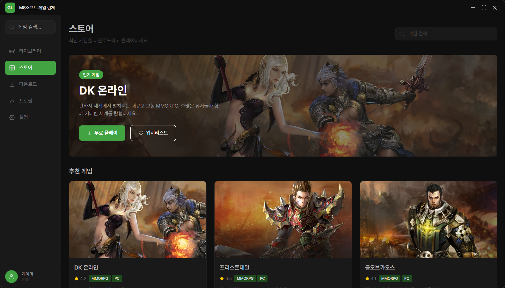
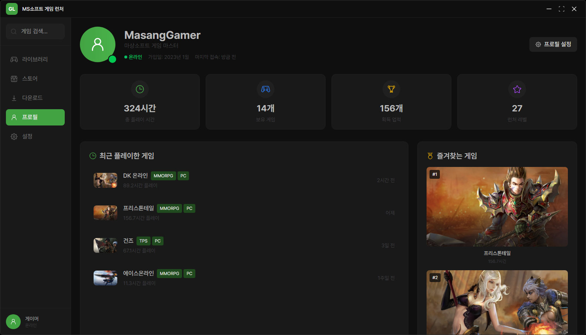

# 🎮 Masang Game Launcher

마상소프트 게임을 위한 데스크톱 게임 런처입니다. Electron과 React를 기반으로 제작되었습니다.


## ✨ 주요 기능

### 🏠 라이브러리
- 설치된 게임 목록을 그리드/리스트 뷰로 전환하여 확인
- 게임별 태그, 설명, 플레이 시간 정보 제공
- 게임 실행, 설치, 다운로드 기능


### 🛒 스토어
- 마상소프트의 모든 게임을 한눈에 확인
- 게임별 평점, 태그, 설명 제공
- 무료 게임 다운로드 및 위시리스트 기능



### 📥 다운로드
- 실시간 다운로드 진행률 및 속도 모니터링
- 다운로드 일시정지/재시작/취소 기능
- 다운로드 설정 및 대역폭 관리


### 👤 프로필
- 게임 플레이 통계 및 업적 시스템
- 최근 플레이한 게임 기록
- 즐겨찾는 게임 순위



### ⚙️ 설정
- 런처 및 게임 설정 관리
- 테마 및 언어 설정
- 보안 및 계정 관리


## 🚀 설치 및 실행

### 필수 요구사항
- Node.js 18.0.0 이상
- npm 8.0.0 이상

### 1. 저장소 클론
```bash
git clone https://github.com/HOLYMOLYJUN/electron-game-launcher.git
cd electron-game-launcher
```

### 2. 의존성 설치
```bash
npm install
```

### 3. 개발 모드 실행
```bash
npm run dev
```

### 4. 빌드 (배포용)
```bash
npm run build
```

빌드된 실행 파일은 `release/build/0.0.0/` 폴더에 생성됩니다.

## 🛠️ 기술 스택

### 프론트엔드
- **React 18** - UI 라이브러리
- **TypeScript** - 타입 안전성
- **Tailwind CSS v4** - 스타일링
- **React Router** - 클라이언트 사이드 라우팅

### 데스크톱
- **Electron** - 크로스 플랫폼 데스크톱 앱
- **Vite** - 빌드 도구 및 개발 서버

### 아이콘
- **Iconoir React** - Iconoir 아이콘 세트

## 📁 프로젝트 구조

```
src/
├── components/          # 재사용 컴포넌트
│   ├── GameCard.tsx    # 게임 카드 컴포넌트
│   ├── Sidebar.tsx     # 사이드바 네비게이션
│   └── TitleBar.tsx    # 커스텀 타이틀바
├── pages/              # 페이지 컴포넌트
│   ├── Home.tsx        # 라이브러리 페이지
│   ├── Store.tsx       # 스토어 페이지
│   ├── Downloads.tsx   # 다운로드 페이지
│   ├── Profile.tsx     # 프로필 페이지
│   └── Settings.tsx    # 설정 페이지
├── routes/             # 라우터 설정
│   └── AppRoutes.tsx
├── App.tsx             # 메인 앱 컴포넌트
└── main.tsx           # 앱 진입점

electron/
├── main.ts            # Electron 메인 프로세스
├── preload.ts         # 프리로드 스크립트
└── electron-env.d.ts  # TypeScript 타입 정의

public/
└── fonts/             # 커스텀 폰트 (Pretendard)
```

## 🎨 디자인 시스템

### 색상 팔레트
- **Primary**: 녹색 계열 (#42a343)
- **Neutral**: 회색 계열 (#2F2E30 ~ #0f0f0f)
- **Warning**: 빨간색 계열 (#d83639)

### 폰트
- **Pretendard Variable** 

## 🔧 개발 스크립트

```bash
# 개발 서버 시작
npm run dev

# 빌드
npm run build

# 린트 검사
npm run lint

# 미리보기
npm run preview
```
.
